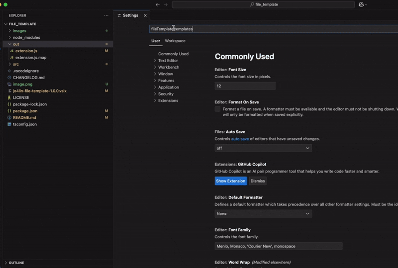
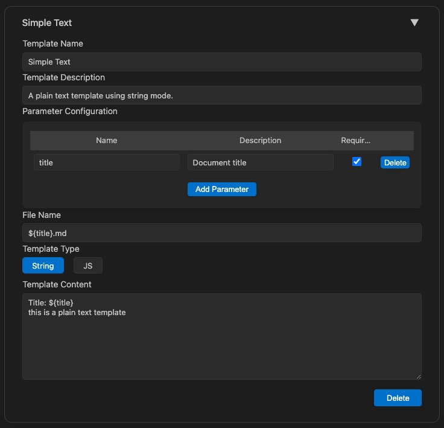
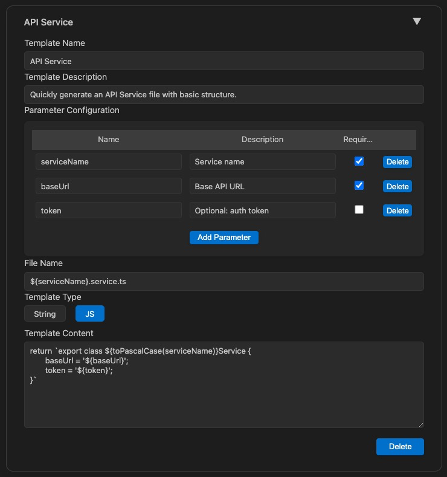

# File Template VSCode Extension

Easily create new files from custom templates in VSCode. Supports parameterized templates, JS logic, and visual management.

[中文说明](https://blog.csdn.net/lll12306/article/details/148674286?spm=1011.2124.3001.6209)

## Features
- Visual template management (add, edit, delete) in settings
- Parameterized templates (plain string or JS logic)
- Quickly create files from right-click menu or command palette
- Import/export templates

## Getting Started

1. Install the extension and reload VSCode.
2. Open VSCode settings, search for `fileTemplate.templates`, and click **Manage Templates** to open the visual manager.
3. Add or edit templates as needed (auto save). You can also edit JSON directly via **Edit in settings.json**.
4. To create a file, right-click a folder and select **New File from Template**, or use the command palette.

## Template Configuration Example
- use string

- ues js

## Parameter Input
- If a template has multiple parameters, input them comma-separated in order (e.g. `foo,bar,baz`).
- If a parameter is required and left blank, you will be prompted.
- Parameter descriptions are only shown in the management UI.

## FAQ
- **How do I use JS logic in templates?**
  - Set `templateType` to `js`. You can use `${param}` and utility functions like `toPascalCase`(service_name -> ServiceName)、`toSnakeCase`(ServiceName -> service_name).
- **Where can I see/edit template details?**
  - Use the visual manager in settings.
- **How do I import/export templates?**
  - Use the buttons in the management UI.

For more help, open an issue or check the extension page in VSCode Marketplace. 